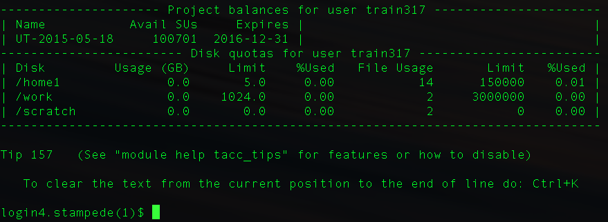
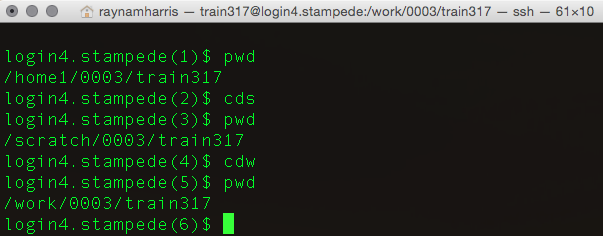

# Using the TACC Clusters

## Learning objectives
- know where to get more detailed information on the clusters
- use ssh to logon to TACC

## User Guides

**The Stampede User Guide**: For complete up-to-date information, see the complete [Stampede User Guide](https://portal.tacc.utexas.edu/user-guides/stampede).

## Use SSH to logon to TACC

~~~ {.bash}
$ ssh <username>@stampede.tacc.utexas.edu
~~~

The very first time you do this from a particular computer, you will be asked if you are sure you want to login. Type `yes`. 

~~~ {.output}
The authenticity of host 'stampede.tacc.utexas.edu (129.114.62.11)' can't be established.
ECDSA key fingerprint is SHA256:g8VAo69oa8wVL8LKKl3rojHpcH2eaMyoyGihXIuiaTU.
Are you sure you want to continue connecting (yes/no)?
~~~

Then, you will be prompted to enter your password. You won't see anything when you type, so just trust that you are typing. The backspace key does not work here, so if you type incorrectly, you will have to hit enter and wait for the prompt to ask for a second attempt.

~~~ {.output}
Password:
~~~

Then, you will be greeted with a login screen. 

## $HOME, $WORK, and $SCRATCH directories
The TACC HPC platforms have pre-defined, user-owned directories with distinct storage characteristics. Because these file systems are shared with other users, they are managed by either a quota limit, a purge policy (time-residency) limit, or a migration policy. The three major directories ($HOME, $WORK and $SCRATCH) are designed for parallel and high performance data access of large files from within applications. 

The nomenclature $HOME, $WORK and $SCRATCH used represented the **enviornment variable** for these directories. The is because the full path to these directories includes both your group number and your username

Let's compare and contrast the three directories

 | $HOME | $WORK | $SCRATCH
:---|:---|:---|:---
full path | `/home1/<group>/<user>` | `/work/<group>/<user>` | `/work/<group>/<user>`
`cd` shorcut | `cd`, `cdh`, and ` cd ~` | `cdw` | `cds`
purpose | store code and executables | run jobs, store large files | run jobs, store large files
quota | 5GB or 150K files | 1TB or 3M files | 8.5 PB
backed up? | yes | no | no
purged | no | no | yes
accessible by all clusters? | no | yes | no

### Exercise 1
Use the `cd` shorcuts to navigate from $HOME to $SCRATH to $WORK then back $HOME.

### Exercise 2
Identify the full path to your partner's scratch directory. Navigate to your partner's scratch directory using that full path.

Your terminal window gives you some clues as to where you are in your file structure, but its not as informative as it could be. In the next lesson, we will modify out profile to proved access to some useful resources and to modify our shell prompt so that we get a little more information when we look at it.  

## Proceed to the Next and Previous lessons
**Next Lesson:** [04 Configure Profile](04_Configure_Profile.md)   
**Previous Lesson:** [02 Create a TACC account](02_Create_Account.md)  
