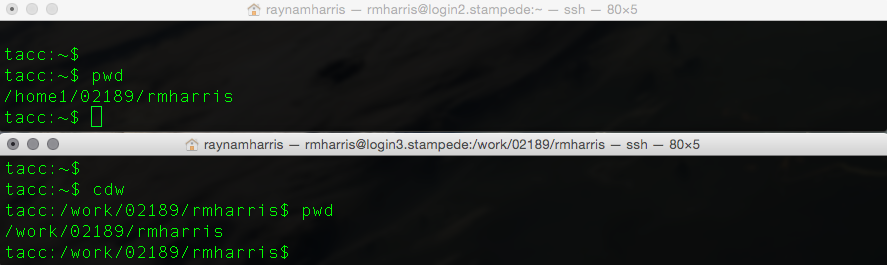

# Configuring Your Profile

## Learning objectives
- know the resources provided by the BioITeam
- setup a bioiteam profile
- know how to view hidden files
- know what's in a .profile

## Helpful Resources from the BioITeam

The mission of the [BioIteam](https://wikis.utexas.edu/display/bioiteam/Home) is to provide "one-stop" unified support for bioinformatics software tools, educational resources, implementation, and support. The BioITeam was initially focused on tools for next-generation sequencing (NGS) analysis but has expanded its expertise in recent years. The BioITeam is a group of users interested in pooling our efforts with others to reduce the time we spend implementing new software and databases and on training ourselves and others we work with.

The general model is that TACC serve as the reference implementation for stable software releases so most of the "power computing" can be done at TACC, but in addition acknowledge that most of us use resources in addition to TACC, and often need tools, databases, or other resources not globally supported at TACC.

## Copy a preconfigured profile

~~~ {.bash}
$ cdh
$ cp /corral-repl/utexas/BioITeam/scripts/rnaseq_profile_user ~/.profile
$ chmod 600 .profile
$ source .profile
~~~

~~~ {.output}
#FIXME
ADD output example
~~~

What did we just do? Let's look at the .profile file

## .profile

In order to view invisible files in a directory, we must use the `-a` flag to view all files. 

~~~ {.bash}
$ ls -a
~~~

Now, let's take a look at our .profile file

~~~ {.bash}
$ nano .profile
~~~ 

~~~ {.output}
#!/bin/bash

# include common settings for the NGS course
. /corral-repl/utexas/BioITeam/bin/profile_ngs_course.bash

PATH=$PATH:/work/01184/daras/bin
PATH=$PATH:/work/01184/daras/bin/cutadapt-1.3/bin
~~~

What this does is provide links to some useful files scripts.

Let's look at profile_ngs_course.bash

~~~ {.output}
cd /corral-repl/utexas/BioITeam/bin/
nano profile_ngs_course.bash
~~~

Here, we are going to a storage system on Corral. Then, we use the nano program to open a new file. 

# New shell configuration

A nice benefit from this is that now we have a more informative shell when we login. 

## Proceed to the Next and Previous lessons
**Next Lesson:** [05 Motivating Datasets](05_Datasets.md)  
**Previous Lesson:** [03 Using TACC](03_Using_TACC.md)  