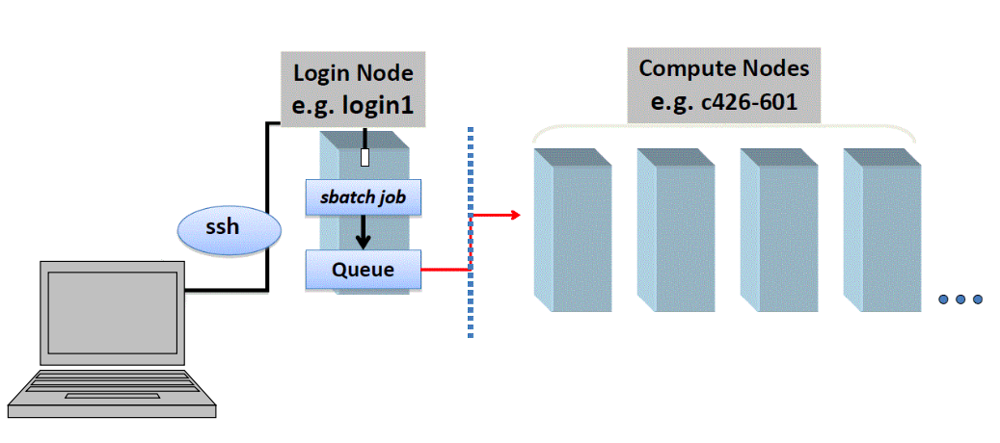

# Launching Jobs

## Learning Objectives
- understand the difference between login and compute nodes
- know that you need a job submission script and a commands file to submit jobs
- understand the two ways to prepare the submission script - launcher.slurm and launcher creator.py
- use both ways to launch jobs

## Login and Compute Nodes
Recall the last time you went to the dentist or the doctor. When you arrived, you signed in, filled out a bunch of paper work about you and your insurance, and maybe paid a co-pay. Then you waited around and read a magazine or played on your phone until your name was called. Then you went into the procedure room where the doctor and nurses came and worked their magic. 

Its not a perfect analogy, but I think this helps conceptualize login and compute nodes. The login nodes are where you go to get all your paper work in order and settle the payment, but compute nodes are where the magic of bioinformatics or computing happen. In the same way that a doctor won't operate on you in the waiting room, don't do your hard core computing on the login nodes.  

In order to use the computer nodes of a super computer like TACC, you must go through a  "Queue Manager" program. This program keeps track of what's running, what is in the queue, and how much processing power and time each of those jobs need. 

The "Queue Manager" program needs two things files from you:

1. a job submission script (.slurm)
2. a commands file (.cmds)

Let's explore in more detail the purpose and contents of these files.

## Job Submission Script

You tell the Queue Manager what you want done in a job submission script. All submission scripts that run on TACC need to have the file extension  `.slurm`. 

This job submission script must specify:
- the number of compute nodes needed
- the allocation to be used
- the maximum run time of the job
- the commands to run

Optional specifications include:
- an standard output file
- an standard error file
- an email for automatic updates about the job
- if the job should wait for another job to finish first
- and other options

## Commands File (.cmds)

In the Unix tutorial, we saw that we could put some commands inside a .sh bash script in order to execute them from the command line. For supercommuting, we put the commands inside a commands file that will be referenced in our job submission script. There are a handful of standard file extensions one can use. The .cmd extension is nice because it helps you see at a glance that this is a commands file.

Your commands file will be referenced in the job submission script. 

